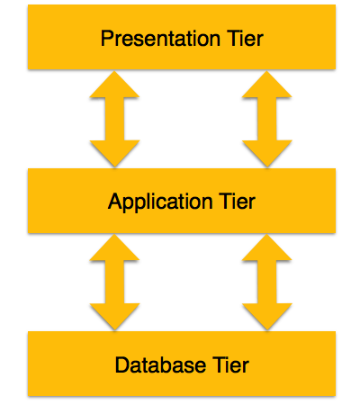

**Credit: **
Contents presented here have been taken from [tutorialspoint DBMS tutorial](https://www.tutorialspoint.com/dbms/dbms_architecture.htm)

# DBMS Architecture

The design of a DBMS depends on its architecture. It can be centralized or decentralized or hierarchical. The architecture of a DBMS can be seen as either single tier or multi-tier. An n-tier architecture divides the whole system into related but independent **n** modules, which can be independently modified, altered, changed, or replaced.

In 1-tier architecture, the DBMS is the only entity where the user directly sits on the DBMS and uses it. Any changes done here will directly be done on the DBMS itself. It does not provide handy tools for end-users. Database designers and programmers normally prefer to use single-tier architecture.

If the architecture of DBMS is 2-tier, then it must have an application through which the DBMS can be accessed. Programmers use 2-tier architecture where they access the DBMS by means of an application. Here the application tier is entirely independent of the database in terms of operation, design, and programming.

# 3-tier Architecture
A 3-tier architecture separates its tiers from each other based on the complexity of the users and how they use the data present in the database. It is the most widely used architecture to design a DBMS.

{ width=50% }

- **Database (Data) Tier** − At this tier, the database resides along with its query processing languages. We also have the relations that define the data and their constraints at this level.

- **Application (Middle) Tier** − At this tier reside the application server and the programs that access the database. For a user, this application tier presents an abstracted view of the database. End-users are unaware of any existence of the database beyond the application. At the other end, the database tier is not aware of any other user beyond the application tier. Hence, the application layer sits in the middle and acts as a mediator between the end-user and the database.

- **User (Presentation) Tier** − End-users operate on this tier and they know nothing about any existence of the database beyond this layer. At this layer, multiple views of the database can be provided by the application. All views are generated by applications that reside in the application tier.

Multiple-tier database architecture is highly modifiable, as almost all its components are independent and can be changed independently.

