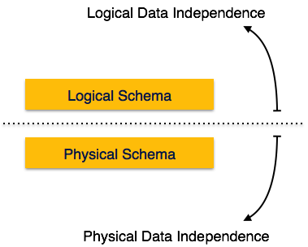

**Credit: **
Contents presented here have been taken from [tutorialspoint DBMS tutorial](https://www.tutorialspoint.com/dbms/dbms_data_independence.htm)

If a database system is not multi-layered, then it becomes difficult to make any changes in the database system. Database systems are designed in multi-layers as we learnt earlier.

# Data Independence
A database system normally contains a lot of data in addition to users’ data. For example, it stores data about data, known as metadata, to locate and retrieve data easily. It is rather difficult to modify or update a set of metadata once it is stored in the database. But as a DBMS expands, it needs to change over time to satisfy the requirements of the users. If the entire data is dependent, it would become a tedious and highly complex job.

Metadata itself follows a layered architecture, so that when we change data at one layer, it does not affect the data at another level. This data is independent but mapped to each other.

# Logical Data Independence
Logical data is data about database, that is, it stores information about how data is managed inside. For example, a table (relation) stored in the database and all its constraints, applied on that relation.

Logical data independence is a kind of mechanism, which liberalizes itself from actual data stored on the disk. If we do some changes on table format, it should not change the data residing on the disk.

# Physical Data Independence
All the schemas are logical, and the actual data is stored in bit format on the disk. Physical data independence is the power to change the physical data without impacting the schema or logical data.

For example, in case we want to change or upgrade the storage system itself − suppose we want to replace hard-disks with SSD − it should not have any impact on the logical data or schemas.
