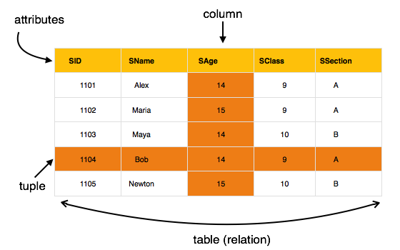

**Credit: **
Contents presented here have been taken from [tutorialspoint DBMS tutorial](https://www.tutorialspoint.com/dbms/dbms_data_models.htm)

# Data Models

Data models define how the logical structure of a database is modeled. Data Models are fundamental entities to introduce abstraction in a DBMS. Data models define how data is connected to each other and how they are processed and stored inside the system.

The very first data model could be flat data-models, where all the data used are to be kept in the same plane. Earlier data models were not so scientific, hence they were prone to introduce lots of duplication and update anomalies.

## Entity-Relationship Model
Entity-Relationship (ER) Model is based on the notion of real-world entities and relationships among them. While formulating real-world scenario into the database model, the ER Model creates entity set, relationship set, general attributes and constraints.

ER Model is best used for the conceptual design of a database.

ER Model is based on −

- **Entities** and their attributes.

- **Relationships** among entities.

These concepts are explained below.

- **Entity** − An entity in an ER Model is a real-world entity having properties called **attributes**. Every **attribute** is defined by its set of values called **domain**. For example, in a school database, a student is considered as an entity. Student has various attributes like name, age, class, etc.

- **Relationship** − The logical association among entities is called **relationships**. Relationships are mapped with entities in various ways. Mapping cardinalities define the number of association between two entities.

Mapping cardinalities −

- one to one
- one to many
- many to one
- many to many

## Relational Model
The most popular data model in DBMS is the Relational Model. It is more scientific a model than others. This model is based on first-order predicate logic and defines a table as an **n-ary relations**.

The main highlights of this model are −

- Data is stored in tables called **relations**.
- Relations can be normalized.
- In normalized relations, values saved are atomic values.
- Each row in a relation contains a unique value.
- Each column in a relation contains values from a same domain.
